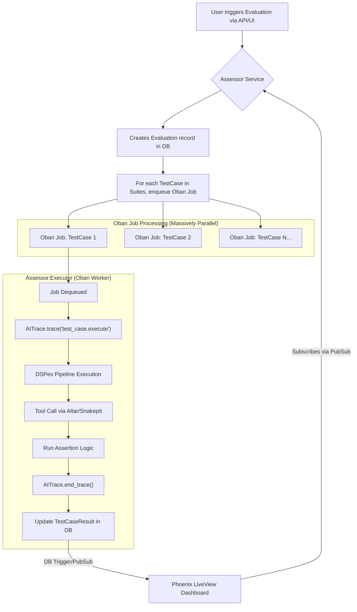

# Assessor

**Document Version:** 1.0
**Status:** Proposed

**1. Vision & Mission**

**Project Name:** `Assessor`

**Vision:** To be the definitive Continuous Integration & Continuous Delivery (CI/CD) platform for AI Quality, enabling teams to ship AI-powered features with the same rigor, confidence, and automation as traditional software.

**Mission:** To provide a scalable, extensible, and observable framework for defining, executing, and analyzing complex evaluation pipelines for AI models and prompts. `Assessor` transforms AI evaluation from a manual, ad-hoc process into a systematic, automated engineering discipline.

**2. The Problem: The Missing Link in MLOps**

While the industry has mature CI/CD tools for code (like Jenkins, GitHub Actions), the process for validating AI components remains dangerously primitive. An engineer can change a single sentence in a prompt or fine-tune a model with a new dataset, and in doing so, silently break a dozen critical capabilities.

The core challenges are:

*   **Scale of Test Cases:** A thorough evaluation requires running a model against thousands or tens of thousands of test cases, spanning regressions, capabilities, safety, and adversarial attacks. This is computationally intensive and requires massive parallelism.
*   **Complexity of Evaluation:** "Accuracy" is a poor metric for modern LLMs. A test case might need to check for valid JSON output, verify a specific reasoning path, or even use *another* powerful LLM (like GPT-4) as a judge to grade the response.
*   **Lack of Structure:** Evals are often managed as a messy collection of notebooks and scripts, making them difficult to version, share, and run consistently.
*   **Observability Black Hole:** When an eval test case fails, it's often a mystery why. You get a `FAIL` status but no deep, debuggable trace of the model's reasoning process during the failure.

`Assessor` is designed to solve these problems by treating "AI evaluations as code," managed within a robust, parallel execution engine.

**3. Core Concepts & Architecture**

`Assessor` is a complete OTP application, built around a high-throughput, durable job processing core. It is architected using the "Transparent Engine" model to ensure every evaluation is deeply observable.

**The Core Architectural Primitives:**

*   **Evaluation (`Ecto Schema`):** The top-level object. An "Evaluation" is a collection of `Test Suites` run against a specific `Model Candidate` (e.g., "Evaluate `Llama3-8B-fine-tuned-v3`"). It has a status: `pending`, `running`, `passed`, `failed`.

*   **Test Suite (`Ecto Schema`):** A version-controlled collection of `Test Cases`. Examples: `regression_suite_v1`, `math_ability_suite_v4`, `safety_red_team_suite_v2`.

*   **Test Case (`Ecto Schema`):** The smallest unit of work. A test case defines an `input` (e.g., a prompt), an `assertion` (e.g., "output must be valid JSON matching this schema," or "output must contain the phrase '60 mph'"), and metadata.

*   **Job Queue (`Oban`):** `Assessor` uses `Oban` as its backbone. When an "Evaluation" is triggered, `Assessor` enqueues thousands of `Oban` jobs—one for each `Test Case` to be executed. This provides durability, retries, and scalability out of the box.

*   **Executor (`Oban Worker`):** The heart of the system is the `Assessor.Executor` module, an `Oban` worker that performs a single test case. This worker is where the entire ecosystem comes together.

**Diagram: `Assessor` Evaluation Flow**



**4. Ecosystem Integration: The `Assessor.Executor`**

The `Assessor.Executor` worker is a masterclass in applying the "Transparent Engine" architecture.

```elixir
# lib/assessor/executor.ex

defmodule Assessor.Executor do
  use Oban.Worker, queue: :evaluations

  # An Oban job performs the work for a single test case.
  @impl Oban.Worker
  def perform(%Oban.Job{args: %{"test_case_id" => id, "model_candidate" => model}}) do
    test_case = Assessor.Repo.get(Assessor.TestCase, id)

    # 1. Every test case execution is a fully traced operation.
    AITrace.trace "assessor.test_case.execute", %{test_case_id: id, model: model.name} do
      # The `ctx` is automatically injected.
      
      # 2. Run the core logic using DSPex. The model endpoint is configured here.
      {:ok, result, new_ctx} = AITrace.span ctx, "model_inference" do
        DSPex.execute(test_case.pipeline, test_case.input, context: ctx, llm: model.endpoint)
      end
      
      # 3. Altar/Snakepit are used implicitly by the DSPex pipeline if it needs tools.
      # The AITrace instrumentation within DSPex captures all of this.

      # 4. Run the assertion to determine pass/fail.
      {:ok, assertion_result, _final_ctx} = AITrace.span new_ctx, "assertion" do
        Assessor.Assertions.run(test_case.assertion, result)
      end

      # 5. Store the detailed results.
      Assessor.Results.store(%{
        test_case_id: id,
        result: assertion_result,
        raw_output: result.raw,
        trace_id: AITrace.Context.get_trace_id(ctx) # CRITICAL: Link the result to its trace!
      })
    end
    
    :ok
  end
end
```

**How the Ecosystem Powers `Assessor`:**

*   **`AITrace`:** This is the killer feature. Every single test case execution generates a rich, debuggable trace. When a test fails, you don't just get a `FAIL` status; you get a `trace_id` that you can plug into your "Execution Cinema" UI to see the model's exact, step-by-step reasoning that led to the failure. This is a revolutionary improvement over current evaluation workflows.
*   **`DSPex`:** `DSPex` provides the language for defining the "work" to be done in a test case. A simple test might be a single `Predict` module, while a complex one could be a multi-step `ChainOfThought` or `ReAct` program.
*   **`Altar`:** `Altar` governs the tools available *during an evaluation*. This is a crucial for safety and consistency. You can ensure that an evaluation for a "customer service bot" only has access to a mock "get_order_status" tool, preventing it from touching production systems.
*   **`Snakepit`:** `Snakepit` provides the massively parallel execution grid for running the thousands of concurrent model inference calls generated by the `Oban` workers. Its streaming capabilities can be used for complex tests that require observing the model's output in real-time.

**5. Key Features**

*   **Evaluation as Code:** Test suites and cases are defined in code or configuration, allowing them to be version-controlled alongside models and prompts.
*   **Massively Parallel Execution:** Built on `Oban` to run tens of thousands of test cases concurrently, leveraging the full power of the BEAM.
*   **Deeply Observable Failures:** Every test result is linked to a full `AITrace` record, enabling instant, forensic debugging of failures.
*   **Extensible Assertions:** A pluggable assertion system allows for everything from simple string matching to complex, LLM-judged evaluations.
*   **Results Warehouse:** All evaluation results are stored in a structured database, enabling powerful analytics and trend monitoring over time.
*   **Live Dashboard:** A Phoenix LiveView interface provides a real-time view of running evaluations and a rich UI for exploring historical results and their associated traces.

`Assessor` completes the ecosystem by providing the critical feedback loop. It is the quality gate that ensures the intelligent agents built with `Synapse` are reliable, safe, and performant enough to be shipped to production.
